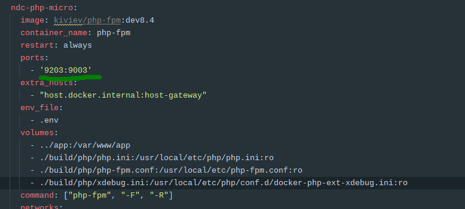

# docker-nginx-php-environment

### Config for Xdebug and PhpStorm/Intellij

#### PhpStorm Xdebug Port config

#### docker-compose.yml Port Config

#### PhpStorm Server config

#### docker-compose.yml .env Config
